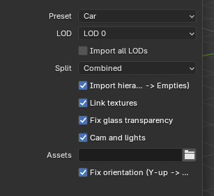
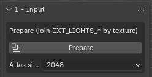
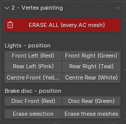
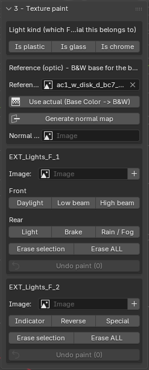
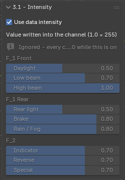
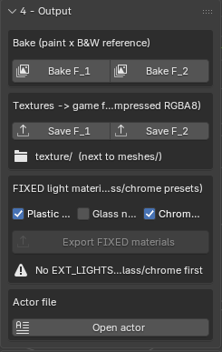
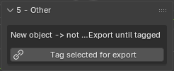

# ACE Blender Add-on

A Blender add-on for importing and exporting Assetto Corsa EVO car meshes
(`.mesh` / `.material` / `.texture`), with a dedicated workflow for building
and painting the car's data-driven light system (function masks, vertex-color
positions, and the "FIXED" light materials the game expects).

Tutorials will comes step by step here: [Youtube channel](https://www.youtube.com/@ALIEN_ONE-mods)
Updates will be here: [Patreon](https://www.patreon.com/cw/alien_one)
everything is free, no membership needed.

## Installation

1. Zip the `mesh/` folder from this repository (or download a release zip).
2. In Blender: **Edit > Preferences > Add-ons > Install...**, select the zip,
   then enable **AC Mesh**.
3. The add-on adds an **AC Mesh** tab to the 3D Viewport sidebar (press `N`
   to open it), plus **File > Import/Export > Assetto Corsa Mesh (.mesh)**.

## Import options

**Preset**
- `Car` — simple import with textures, lights and cam, ready for rendering.
- `Track` — simple import for tracks; lights, cameras and the glass fix are
  turned off.
- `Light paint` — prepares the import for light painting: forces a split by
  material and by texture.

**LOD** — select which level of detail to import. `LOD 0` is the most
detailed, `LOD 5` the least detailed.

**Split** — choose how the mesh is split on import:
- `Combined` — merge every mesh into one.
- `Split by material` — split the mesh per material; each resulting mesh is
  named after its material in the `materials` folder. Useful for debugging.
- `By rigid part` — requires **Import hierarchy** to be on. Meshes are split
  and sorted by their parenting to the imported "empties".

**Import hierarchy** — also import the "empties" (suspension points, flame
points, wiper points, mirrors, doors, etc.).

**Link textures** — converts the textures into a Blender-friendly format so
they preview on the car. Import is limited to BC7 (colour textures) and BC6
(normal map textures) to keep the add-on as lightweight as possible.

**Fix glass transparency** — automatically reduces the alpha of the
`WINDOWS` material so it renders as transparent. `Car` preset only.

**Cam and lights** — adds 3 point lights and 3-4 cameras for an instant
render. `Car` preset only.

**Assets** — path to the `common` folder, if the car/material references
shared assets.

**Fix orientation** — reorients the import from Blender's Z-up axis to
Y-up, so the imported model isn't lying on its side.

---

## Workflow

### 1 - Input

**Prepare** merges every object with "EXT_LIGHTS" in its name into one mesh,
then repacks and rebakes its UVs into a single, non-overlapping atlas
texture (size set by **Atlas size**).

This step exists because AC1-era light meshes routinely reused the same
patch of texture across several unrelated UV islands — there was no
per-pixel function masking back then, so overlapping UVs didn't matter. It
does now: painting a function mask (daylight, indicator, brake, etc.) over
one island would bleed into every other island that used to share that same
patch. Running Prepare first gives every island its own, unshared pixels
before anything gets painted onto them, and automatically detects mirrored
(left/right) parts so a symmetric car doesn't waste half the atlas on a
duplicate. It also auto-generates the black & white reference and the
normal map used by the later steps, so nothing needs to be set up by hand
before painting starts.

### 2 - Vertex painting

Paints the light/brake-disc *position* (front left, rear right, centre
front, disc front, etc.) as a per-vertex colour, separate from the function
textures painted in the next step. The engine reads a light's front/rear
side from this vertex colour, not from a texture — so positions are set
here, once per mesh, before moving on to the more involved texture work.

### 3 - Texture paint

**Light kind** — defines whether the selected faces belong to a plastic,
glass, or chrome light housing. Sends them into a dedicated mesh (created on
first use, merged into on every call after that), with its own dedicated
material created automatically.

**Reference (optic)** — auto-filled during the Prepare phase: a black & white
version of the new atlas texture is generated automatically for baking the
F1/F2 masks, along with a new normal map. You can point this at a different
image and generate a fresh black & white copy and normal map for it with the
buttons provided, but in the normal workflow you don't need to touch
anything here.

**EXT_Lights_F_1 & F_2** — the heart of the add-on. Creates the F1/F2
textures (1024x1024 by default) and paints the right colour into them as
each light function is assigned (daylight, low beam, etc.). If you need to
undo a paint, don't use Ctrl+Z — use the **Undo paint** button instead.

### 3.1 - Intensity

If you'd rather not dig into the raw light data to tune intensity, turn off
**Use data intensity**. This tricks the game engine by varying the F1/F2
colour intensity instead of the underlying data — less control, but enough
to correct most results.

You don't need to undo a paint to change intensity this way. For example:
paint your daylight mesh with the **Daylight** button; if it's too bright,
lower the slider and click **Daylight** again — the colour updates in
place, it isn't added on top of the previous paint.
you may need to use undo if this part of the texture is already used by an
existing color.

While **Use data intensity** is on, every channel paints at full intensity
(1.0).

### 4 - Output

**Bake F_1 / F_2** — mixes the painted F1/F2 texture with the black & white
reference to produce a non-flat, more realistic result.

**Save F_1 / F_2** — converts the baked texture to AC EVO's texture format
and saves it into the car's `texture` folder.

**FIXED light materials** — exports the new materials and their textures.
The checkboxes let you choose, per material, whether to also export the
generated normal map for it. The `.material` files are created automatically
in the `materials` folder with every texture correctly linked.

**Actor file** — the car's `.actor` file must declare which materials are
light materials at the root level, or none of this will work in-game. The
bundled editor here is a lightweight option for anyone who doesn't want to
dig through the raw data or install a full Python toolchain — just enough to
declare a texture without any third-party software. If you're doing advanced
light tuning, you likely won't need it.

### 5 - Other

Not related to light painting — lets you add a new mesh to the scene and tag
it for export. The mesh must use an existing material, or the game will
crash.

---

## License

MIT License — see [LICENSE](LICENSE).

Copyright (c) 2026 ALIEN ONE
